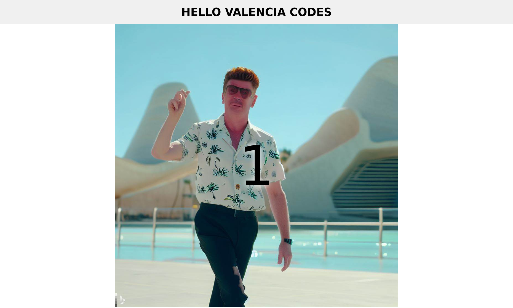

# Generative AI Hackathon

Webpage made in the Generative AI Hackathon organized by [Valencia Codes](https://valenciacodes.com).

[DEMO](https://lmont.es/generative-ai-hackathon)

## How we used generative AI

The image is generated by Bing using this prompt:

> Rick Astley in the never going to give you up video vacationing in the city of arts and science in Valencia

The HTML code is generated by ChatGPT 3 using the next prompt:

> Code me a website that has a header that says "HELLO VALENCIA CODES" We want the website to look professional. We want the website to have a big logo in the middle that is an image named logo.jpeg. We also want there to be a countdown in big black letters superimposed on the logo image that has a countdown from ten to zero. This countdown must be visible. When it gets to zero, the image component must be changed for a youtube video with the url https://www.youtube.com/watch?v=a3Z7zEc7AXQ. Also the video must be centered, start to play and the countdown disappears

## Links

* [Handbook](https://rory-mcelearney.notion.site/Generative-AI-Hackathon-Handbook-47ff3b471da84f4f95cd9f3afa53f26c)
* [Bing image generator](https://www.bing.com/images/create)
* [ChatGPT](https://chat.openai.com)
